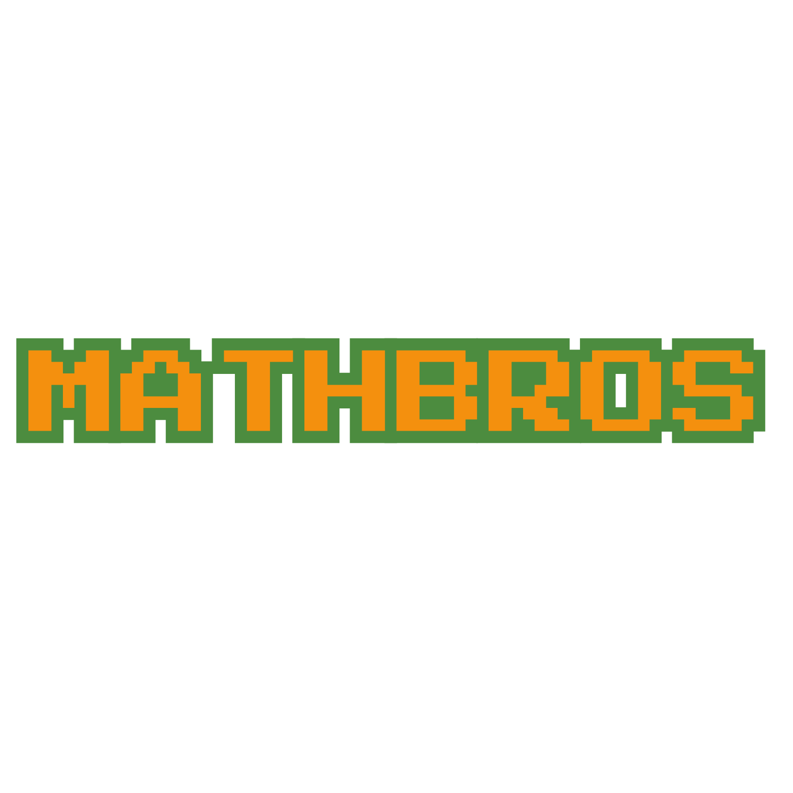

# MathBros: Petualangan Seru Belajar Matematika! 🎮➕➖✖️➗

Selamat datang di **MathBros**, sebuah game edukasi yang menggabungkan keseruan permainan platformer ala Mario Bros dengan tantangan matematika yang mendidik dan menyenangkan! 🎉

## 🎯 Deskripsi
MathBros dirancang khusus untuk anak-anak SD agar mereka dapat belajar matematika dasar seperti penjumlahan, pengurangan, perkalian, dan pembagian sambil bermain. Melalui game ini, kami berharap dapat membantu anak-anak meningkatkan keterampilan matematika mereka dengan cara yang interaktif dan menghibur.

## 🕹️ Fitur Utama
- **Karakter Menarik**: Pemain mengendalikan karakter lucu yang berpetualang melalui berbagai level penuh warna.
- **Level yang Menantang**: Setiap level berisi rintangan dan teka-teki matematika yang harus diselesaikan untuk melanjutkan permainan.
- **Reward dan Poin**: Dapatkan poin dan reward berdasarkan keberhasilan menyelesaikan tantangan matematika. Gunakan poin untuk membuka level baru atau mendapatkan item khusus.
- **Desain Visual yang Menarik**: Grafik dan animasi yang memukau untuk menjaga perhatian dan minat anak-anak.
- **Mode Pembelajaran**: Selain mode permainan utama, tersedia juga mode pembelajaran bebas tekanan untuk berlatih soal-soal matematika.

## 🎮 Cara Bermain
1. **Pilih Karakter**: Mulailah dengan memilih karakter favoritmu.
2. **Jelajahi Level**: Bergeraklah melalui level dengan melompat dan menghindari rintangan.
3. **Selesaikan Soal Matematika**: Temui teka-teki matematika di setiap level dan selesaikan untuk melanjutkan perjalanan.
4. **Kumpulkan Poin**: Dapatkan poin untuk setiap soal yang berhasil diselesaikan dan gunakan untuk membuka level baru.
5. **Bersenang-senang Sambil Belajar**: Nikmati petualangan seru sambil meningkatkan kemampuan matematika!

## 👥 Tim Pengembang
- **Christophouer Adyatma W. S. N. (71210677)**
- **Farrel Ardyanto Saputro (71210702)**
- **Nathanael Vito Kristianto (71210681)**

## 📞 Hubungi Kami
Jika Anda memiliki pertanyaan atau masukan, jangan ragu untuk menghubungi kami melalui email di christophorus.adyatma@ti.ukdw.ac.id.

---

Terima kasih telah mengunjungi proyek MathBros! Kami berharap game ini dapat menjadi alat belajar yang bermanfaat dan menyenangkan bagi anak-anak. Selamat bermain dan belajar! 🌟
